# Audio Pipeline

Voice Notepad processes audio through several stages before sending it to AI models for transcription. This page documents the complete audio processing pipeline.

## Pipeline Overview

```mermaid
flowchart TD
    subgraph Recording
        A[🎤 Microphone Input] --> B[PyAudio Capture]
        B --> C[Raw WAV Buffer]
    end

    subgraph Processing
        C --> D{VAD Enabled?}
        D -->|Yes| E[Silero VAD]
        E --> F[Speech Segments Only]
        D -->|No| G[Full Audio]
        F --> H[Compression]
        G --> H
        H --> I[16kHz Mono WAV]
    end

    subgraph API
        I --> J[Base64 Encode]
        J --> K[Cleanup Prompt + Audio]
        K --> L[AI Model API]
        L --> M[Cleaned Transcript]
    end

    subgraph Storage
        C --> N{Archive Enabled?}
        N -->|Yes| O[Opus Encoder]
        O --> P[Audio Archive]
        M --> Q[SQLite Database]
    end
```

## Stage 1: Recording

Audio is captured using **PyAudio**, which provides cross-platform access to the system's audio input devices.

**Configuration:**
- Sample rate: System default (typically 44.1kHz or 48kHz)
- Channels: Mono or Stereo (depends on device)
- Format: 16-bit PCM

## Stage 2: Voice Activity Detection (VAD)

When enabled, **Silero VAD** detects speech segments and removes silence.

**VAD Parameters:**

| Parameter | Value | Description |
|-----------|-------|-------------|
| Sample Rate | 16kHz | Silero VAD requirement |
| Window Size | 512 samples (~32ms) | Analysis chunk size |
| Threshold | 0.5 | Speech probability cutoff |
| Min Speech | 250ms | Minimum segment duration |
| Min Silence | 100ms | Silence gap to remove |
| Padding | 30ms | Buffer around speech |

**Benefits:**
- Reduces audio file size (often 30-50% smaller)
- Lowers API costs (fewer audio tokens)
- Faster upload times

## Stage 3: Compression

Audio is compressed to **16kHz mono** before API submission.

**Why 16kHz Mono?**

- Gemini internally downsamples to 16kHz mono
- Reduces file size by ~66% compared to 48kHz stereo
- No quality loss for speech transcription
- Consistent results regardless of input format

**Size Comparison:**

| Format | Size per Minute |
|--------|-----------------|
| 48kHz Stereo | ~11 MB |
| 16kHz Mono | ~1.9 MB |
| With VAD (~50% speech) | ~1 MB |

## Stage 4: API Submission

The processed audio is sent to AI models with a cleanup prompt.

**What Gets Sent:**

1. **Audio Data**: Base64-encoded 16kHz mono WAV
2. **Cleanup Prompt**: Instructions for transcription and formatting

**What Comes Back:**

1. **Transcript**: Cleaned, formatted text (markdown)
2. **Token Counts**: Input/output tokens for cost tracking
3. **Cost** (OpenRouter): Actual cost for the request

## Stage 5: Storage

Transcripts are saved to a local SQLite database, with optional audio archival.

**Database Fields:**
- Timestamp
- Provider and model
- Transcript text
- Audio duration (original and post-VAD)
- Token counts
- Estimated/actual cost
- Archive file path (if enabled)

**Audio Archive Format:**
- Codec: Opus
- Bitrate: ~24kbps
- Mode: VoIP (speech-optimized)
- Size: ~180KB per minute

## Complete Pipeline Timing

**Typical Latency:**

| Stage | Duration |
|-------|----------|
| VAD Processing | ~500-1000ms |
| Compression | ~100-500ms |
| API Round-trip | ~1500-3000ms |
| Total | ~2-4 seconds |

## Configuration Options

All pipeline options are configurable in **Settings > Behavior**:

| Option | Default | Description |
|--------|---------|-------------|
| Enable VAD | On | Remove silence before upload |
| Archive Audio | Off | Save Opus copy of recordings |

See [Configuration](configuration.md) for details.
