# Audio Multimodal vs Traditional ASR

Voice Notepad uses **audio multimodal models** rather than traditional ASR (Automatic Speech Recognition). This page explains the difference and when each approach makes sense.

## The Two Approaches

### Traditional ASR Pipeline

```mermaid
flowchart LR
    A[🎤 Audio] --> B[ASR Model]
    B --> C[Raw Transcript]
    C --> D[LLM]
    E[Cleanup Prompt] --> D
    D --> F[Cleaned Text]

    style B fill:#ffcdd2
    style D fill:#bbdefb
```



**Two separate steps:**
1. **ASR Model** (Whisper, Deepgram, etc.) converts audio to raw text
2. **LLM** (GPT-4, Claude, etc.) cleans up the text with a prompt

### Audio Multimodal Pipeline

```mermaid
flowchart LR
    A[🎤 Audio] --> B[Multimodal Model]
    C[Cleanup Prompt] --> B
    B --> D[Cleaned Text]

    style B fill:#c8e6c9
```



**Single step:**
The model accepts both audio and text as inputs, processing them together.

## How It Works

Audio multimodal models like Gemini, GPT-4o Audio, and Voxtral can directly "hear" audio input. When you send both audio and a cleanup prompt, the model:

1. Listens to the audio content
2. Reads the cleanup instructions
3. Produces formatted output in one pass

```
┌─────────────────────────────────────┐
│         Multimodal Model            │
│                                     │
│   Audio Input ────┐                 │
│                   ├──► Processing   │
│   Text Prompt ────┘                 │
│                        │            │
│                        ▼            │
│                   Output Text       │
└─────────────────────────────────────┘
```

## Comparison

| Aspect | Traditional ASR + LLM | Audio Multimodal |
|--------|----------------------|------------------|
| API Calls | 2 (ASR then LLM) | 1 |
| Latency | Higher (sequential) | Lower (single pass) |
| Context | LLM only sees text | Model "hears" audio |
| Verbal Instructions | Lost in ASR | Understood directly |
| Cost | Variable | Single pricing |
| Complexity | More integration | Simpler |

## Advantages of Audio Multimodal

### 1. Single API Call

Traditional workflow requires two separate API calls:
```
Audio → Whisper → Raw text → GPT-4 → Clean text
         ↑ $$$               ↑ $$$
```

Multimodal requires one:
```
Audio + Prompt → Gemini → Clean text
                   ↑ $$$
```

### 2. Lower Latency

Sequential calls add up:
- ASR: ~1-2 seconds
- LLM: ~1-2 seconds
- **Total: ~2-4 seconds**

Single multimodal call:
- **Total: ~1.5-3 seconds**

### 3. Audio Context Preserved

The multimodal model actually "hears" your recording. This means it can:

- Distinguish between similar-sounding words based on context
- Understand tone and emphasis
- Follow verbal corrections naturally

**Example:**
> *"I said 'their' not 'there'... actually, delete that whole part"*

A traditional ASR might transcribe this literally, then the LLM would have to parse it. A multimodal model understands the correction directly from hearing it.

### 4. Verbal Instructions Work

You can speak instructions to the model:

- "New paragraph"
- "Delete the last sentence"
- "Don't include what I just said"
- "Actually, change that to..."

The model hears these as audio and understands them as commands.

### 5. Simpler Architecture

One model, one API, one integration point:

```python
# Multimodal approach
response = model.generate(
    audio=audio_data,
    prompt="Transcribe and clean up this audio..."
)

# vs Traditional approach
transcript = whisper.transcribe(audio_data)
cleaned = gpt4.complete(
    prompt=f"Clean up this transcript: {transcript}"
)
```

## When Traditional ASR Makes Sense

Audio multimodal isn't always the better choice:

### High-Volume Transcription

For bulk transcription without cleanup, dedicated ASR can be:
- Faster for raw output
- Cheaper per minute of audio
- More efficient for batch processing

### Specialized Domains

Traditional ASR models can be fine-tuned for:
- Medical terminology
- Legal jargon
- Technical vocabulary
- Specific accents

### Offline Processing

Some ASR models (like Whisper) can run fully offline, while multimodal models require cloud APIs.

### Maximum Control

Two-step pipelines let you:
- Choose different models for each step
- Apply custom post-processing
- Use different providers for ASR vs LLM

## Models Supporting Audio Multimodal

Voice Notepad supports these audio-capable multimodal models:

| Provider | Models | Notes |
|----------|--------|-------|
| **Google** | Gemini 2.0/2.5 Flash | Fast, cost-effective |
| **OpenAI** | GPT-4o Audio | High quality |
| **Mistral** | Voxtral | Speech-optimized |

Accessed via:
- **OpenRouter** (recommended) - Single API for all models
- Direct provider APIs

## The Voice Notepad Approach

Voice Notepad is designed specifically for the multimodal workflow:


The cleanup prompt instructs the model to:
1. Transcribe the audio
2. Remove filler words (um, uh, like)
3. Add punctuation and paragraphs
4. Follow any verbal instructions
5. Format as markdown

All in a single pass.

## Summary

| Use Audio Multimodal When | Use Traditional ASR When |
|---------------------------|--------------------------|
| You want cleaned output | You need raw transcripts |
| Verbal editing is useful | Bulk/batch processing |
| Simplicity matters | Maximum customization |
| Single API is preferred | Specialized vocabulary |
| Latency is important | Offline capability needed |

Voice Notepad focuses on the multimodal approach because it's ideal for quick, cleaned transcriptions where you want to speak naturally—including corrections and formatting instructions—and get polished output directly.
