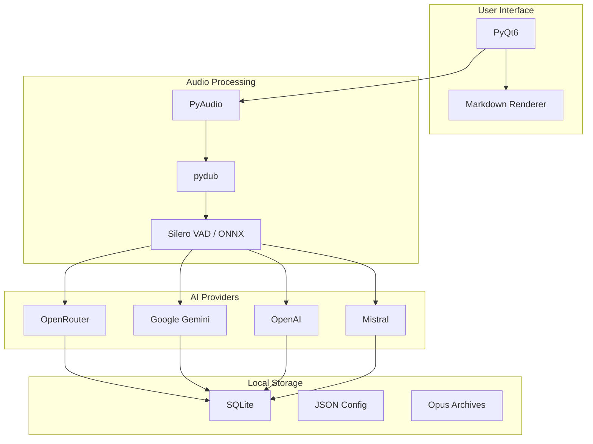
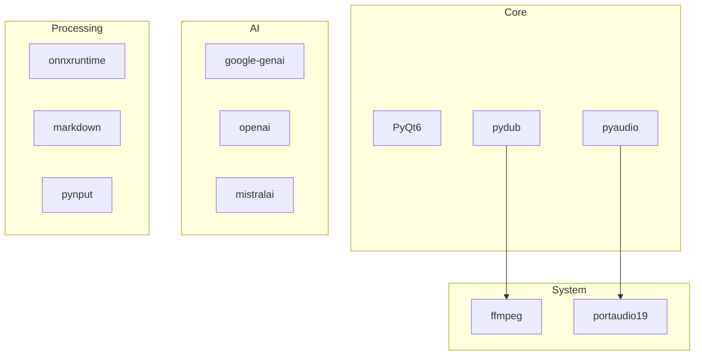

# Technology Stack

Voice Notepad is built with a focused set of technologies optimized for desktop audio processing and AI integration.

## Architecture Overview



## Core Technologies

### User Interface

| Component | Technology | Purpose |
|-----------|------------|---------|
| GUI Framework | **PyQt6** | Cross-platform desktop UI |
| Markdown | **markdown** | Render formatted transcripts |
| Hotkeys | **pynput** | Global keyboard shortcuts |

**PyQt6** provides a native desktop experience with:
- Tabbed interface for different views
- System tray integration
- Keyboard shortcuts
- Settings dialogs

### Audio Processing

| Component | Technology | Purpose |
|-----------|------------|---------|
| Capture | **PyAudio** | Record from microphone |
| Processing | **pydub** | Audio format conversion |
| VAD | **Silero VAD** | Speech detection |
| Inference | **onnxruntime** | Run VAD model |
| Archive | **Opus codec** | Efficient speech storage |

**Audio Pipeline:**
```
PyAudio → pydub → Silero VAD → pydub → API
                                  ↓
                            Opus Archive
```

### AI Provider SDKs

| Provider | SDK | Model Examples |
|----------|-----|----------------|
| OpenRouter | **openai** (compatible) | Gemini, GPT-4o, Voxtral |
| Google | **google-genai** | gemini-2.5-flash |
| OpenAI | **openai** | gpt-4o-audio-preview |
| Mistral | **mistralai** | voxtral-small-latest |

All providers use their official Python SDKs. OpenRouter uses the OpenAI SDK with a custom base URL.

### Storage

| Component | Technology | Purpose |
|-----------|------------|---------|
| History | **SQLite** | Transcript database |
| Config | **JSON** | Settings and API keys |
| Audio | **Opus** | Archived recordings |

## Dependency Graph



## Python Dependencies

```txt
# UI
PyQt6>=6.6.0

# Audio
pyaudio>=0.2.14
pydub>=0.25.1
audioop-lts>=0.2.0  # Python 3.13+ compatibility

# AI Providers
google-genai>=1.0.0
openai>=1.40.0
mistralai>=1.0.0

# Processing
onnxruntime>=1.16.0
markdown>=3.5.0
pynput>=1.7.6
httpx>=0.27.0
```

## System Dependencies

These must be installed at the system level:

| Package | Ubuntu/Debian | Purpose |
|---------|---------------|---------|
| Python 3.10+ | `python3` | Runtime |
| FFmpeg | `ffmpeg` | Audio processing |
| PortAudio | `portaudio19-dev` | Audio capture |

```bash
sudo apt install python3 python3-venv ffmpeg portaudio19-dev
```

## External Services

### AI APIs

| Service | Endpoint | Authentication |
|---------|----------|----------------|
| OpenRouter | `openrouter.ai/api/v1` | API Key |
| Google AI | `generativelanguage.googleapis.com` | API Key |
| OpenAI | `api.openai.com/v1` | API Key |
| Mistral | `api.mistral.ai/v1` | API Key |

### Downloaded Models

| Model | Source | Size | Purpose |
|-------|--------|------|---------|
| Silero VAD | GitHub | ~1.4 MB | Voice detection |

The VAD model is downloaded automatically on first use to `~/.config/voice-notepad-v3/models/`.

## File Locations

```
~/.config/voice-notepad-v3/
├── config.json           # Settings and API keys
├── transcriptions.db     # SQLite history database
├── usage/                # Daily cost tracking (JSON)
├── audio-archive/        # Opus recordings (if enabled)
└── models/
    └── silero_vad.onnx   # VAD model
```

## Build & Package

| Tool | Purpose |
|------|---------|
| dpkg/fakeroot | Build .deb packages |
| MkDocs | Documentation site |
| venv | Python isolation |

## Technology Choices

### Why PyQt6?

- Native look and feel on Linux
- Comprehensive widget set
- Good system tray support
- Active development

### Why Silero VAD?

- Small model size (~1.4 MB)
- Fast inference on CPU
- High accuracy for speech detection
- MIT license

### Why SQLite?

- Zero configuration
- Single file database
- Good for local storage
- Python built-in support

### Why Opus for Archives?

- Best-in-class speech compression
- ~24kbps with excellent quality
- Open standard
- Native FFmpeg support
